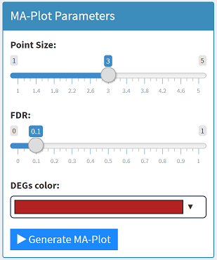
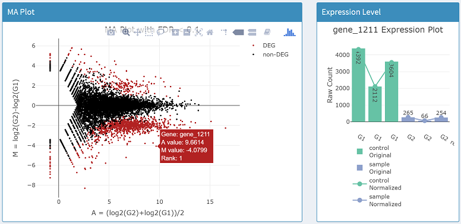
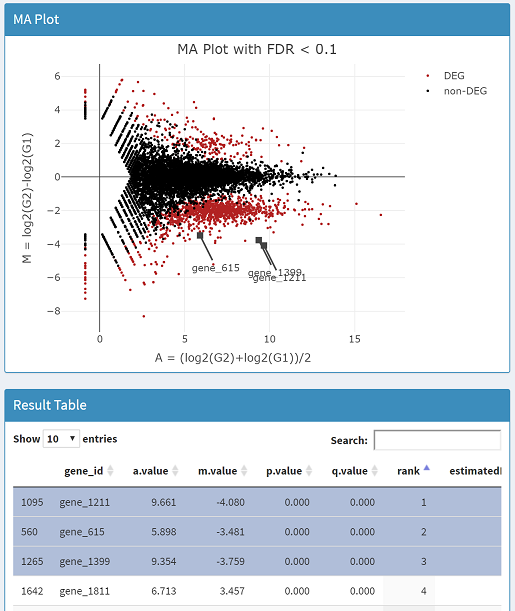
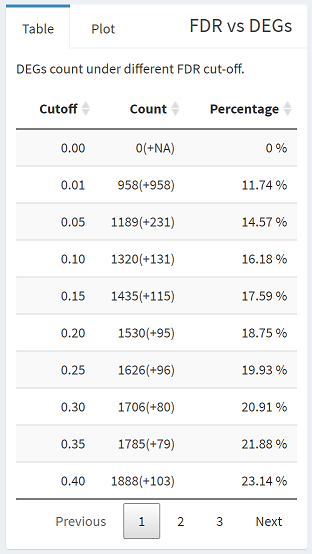

# What's MA Plot?
An MA plot is an application of a Bland–Altman plot for visual representation of genomic data. The plot visualizes the differences between measurements taken in two samples, by transforming the data onto M (log ratio) and A (mean average) scales, then plotting these values. Though originally applied in the context of two channel DNA microarray gene expression data, MA plots are also used to visualise high-throughput sequencing analysis (quote from [wikipedia](https://en.wikipedia.org/wiki/MA_plot)).

---

1. Change parameters or just leave it as default, click **[Generate MA-Plot]** button, and the MA plot will show up in the middle of the page.  
  
2. If you want to check the infomation of specific point (transcript or gene), hover your cursor on the point, and the additional information will be print out (on the right side of the page, a expression level plot will also be provided).  
  
3. If you want to mark some genes on the plot, please click the specific rows of the gene in  **Result Table** panel, and click **[Generate MA-Plot]** button again to refresh the plot.   
  
4. On the left of the page, you will see lots of different FDR cut off and the count of DEGs in  **FDR vs DEGs** panel.  
    
5. On the right of the page, R code of MA Plot is also provided.   
